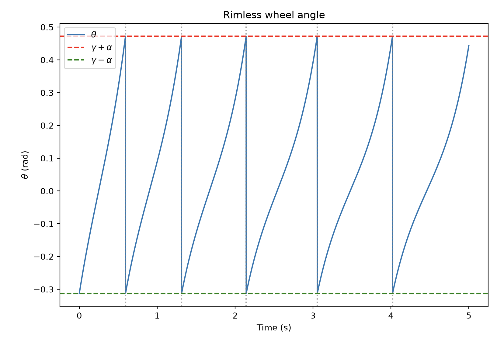
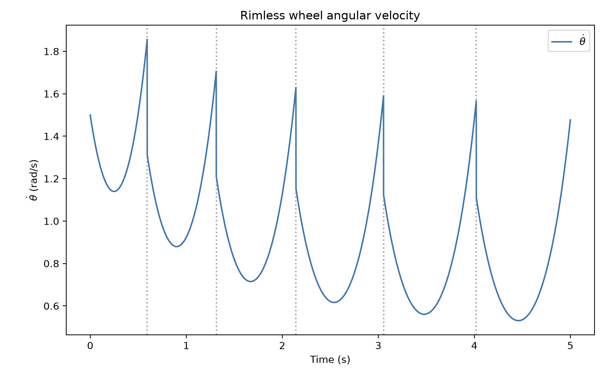

# Assignment 1: Rimless Wheel Analysis

## Assignment Description

In this assignment, we study a rimless wheel moving down a slope.
The wheel is modeled as a point mass with $N$ evenly spaced, massless spokes of length $l$.
The slope of the inclined plane is $\gamma$ and the state of the system is $[\theta, \dot{\theta}]$, where $\theta$ is the stance spoke's angle from the upward vertical, positive downhill.

The goal of this assignment was to implement this model and understand its stability through plotting the region of attraction (RoA), the Poincaré return map, and the Floquet multiplier.

## Sanity Checks : assignment_1

To check that the model behaved as expected, I tested the collision reset, the continuous dynamics, and the system's energy using $N = 8$ spokes and a slope of $\gamma = 0.08$ rad (same values as Russ Tedrake's, also for sanity's sake).

For a downhill impact, I expected the stance angle to change from $\gamma + \alpha$ to $\gamma - \alpha$, where $\alpha = \pi/N$, and the angular velocity to decrease by a factor of $\cos(2\alpha)$. Starting at 2 rad/s, the reset returned approximately 1.414 rad/s and the correct stance angle, without immediately triggering another impact.

For the continuous dynamics, I checked the angular acceleration at a negative angle, at the upright position, and at a positive angle. I expected negative, zero, and positive acceleration, respectively, since gravity accelerates the wheel away from upright. The calculated accelerations matched $\ddot{\theta} = (g/l)\sin(\theta)$, and both sets of assertions passed.

Finally, I plotted the kinetic, potential, and total energy during a five-second simulation. I expected total mechanical energy to remain constant between impacts and decrease at each inelastic collision. The plot showed flat total energy between impacts and downward jumps at all nine collisions, matching the expectation.

<table>
  <tr>
    <td></td>
    <td></td>
  </tr>
  <tr>
    <td></td>
    <td></td>
  </tr>
</table>

## Regions of Attraction (RoA)

I then estimated the regions of attraction by brute force.
Using $N = 8$ and $\gamma = 0.08$ rad (which is like, 4.6 deg), I sampled 81 initial angles between $\gamma - \alpha \approx -0.313$ rad and $\gamma + \alpha \approx 0.473$ rad, and 161 initial angular velocities between $-3$ and $3$ rad/s. For these parameters, I expected two stable attractors: standing at rest on two spokes and a downhill rolling limit cycle.

Each simulation ran for up to 30 seconds, stopping early once its outcome could be classified.
I classified rolling when the last six downhill post-impact speeds were positive and each consecutive pair differed by less than $10^{-4}$ rad/s, and classified settling when the wheel had too little energy after a downhill impact to reach the upright position again. This energy check identifies eventual standing without simulating all of the small rocking motions before rest.

To make the grid simulation faster, I used RK4 with a timestep of $0.01$ s and refined the collision time using bisection to a tolerance of $10^{-9}$ s. The simulation applies the impact reset at the contact time and then integrates the remaining part of the timestep. This allows larger steps during smooth motion while locating collisions precisely.

The plot shows the initial angle on the horizontal axis and the initial angular velocity on the vertical axis. Red states were classified as standing, while blue states converged to downhill rolling.

## Poincaré Return Map

I used the collision event as a Poincaré section and constructed a 1D return map using the angular velocity immediately after each impact.

The horizontal axis shows the current post-impact velocity, $\omega_n$, and the vertical axis shows the velocity after the next collision, $\omega_{n+1} = P(\omega_n)$. The black dashed line is the identity line (used for stability analysis-- an intersection of the return map with this line indicates an equilibrium point, marked with a cross), $\omega_{n+1} = \omega_n$.

For $N = 8$ and $\gamma = 0.08$ rad, the blue fixed point is at approximately $\omega^* = 1.09546$ rad/s. This equilibrium represents the rolling limit cycle.

The red point at $\omega = 0$ represents the equilibrium where the angle and angular veloctiy are zero, and everything is standing still.

 Pink shading indicates initial post-impact velocities that eventually settle, while blue hatching indicates velocities that converge to rolling. The magenta dashed lines mark the critical velocities, approximately $-1.46679$ and $0.97542$ rad/s, separating uphill steps, rocking returns, and downhill steps.

## Floquet Multiplier

The Floquet multiplier describes how a small disturbance changes from one step to the next near the rolling limit cycle. For this one-dimensional return map, it is the slope at the rolling fixed point, $\lambda = P'(\omega^*)$.

It basically allows us to classify stability: a multiplier with $|\lambda| < 1$ means the errors shrink and the rolling cycle is locally stable, while $|\lambda| > 1$ means they grow. At $|\lambda| = 1$, this linear estimate is inconclusive.

For $\gamma = 0.08$ rad and $N = 8$, I estimated the multiplier by starting slightly above and below the rolling fixed point, $\omega^* \approx 1.09546$ rad/s, and simulating one downhill step from each starting speed. I calculated the slope using

$$
\lambda \approx \frac{P(\omega^* + \varepsilon) - P(\omega^* - \varepsilon)}{2\varepsilon},
$$

where $\varepsilon$ is the size of the speed disturbance. I repeated this for five perturbation sizes, halving $\varepsilon$ each time.

The left plot shows the return map close to the rolling fixed point, marked by the black star. The points from both sides lie close to a straight line with a slope of approximately 0.5, compared with the identity line's slope of 1. This means a small speed error shrinks by about half after each impact.

The right plot shows how the estimated multiplier changes as the perturbation size decreases.
 It checks the consistency of the slope estimate. The smallest perturbation gave $\lambda \approx 0.49999906$, which agrees closely with the analytic value $\cos^2(2\pi/N) = 0.5$.

## Effects of incline angles $\gamma$

Obviously, $\gamma = 0.08$ rad (4.5 deg) is a very small amount incline, so the question now is, what happens when the angle is increased/decreased?

Side note: When the incline angle was really small, initially my code would enter an infinite loop-- the wheel could lose enough energy to stop rolling and rock back and forth instead. To handle this, I added `should_settle()` in `assignment_1.py`, which after a downhill impact, checks whether the wheel has enough kinetic energy to reach the upright position again. If it does not, the code sets the angular velocity to zero and returns a settled flag, treating the remaining rocking motion as eventual rest.

### Incline Angle $\gamma = 0.26$ rad

When I increased the incline to $\gamma = 0.26$ rad, as expected, the kinetic-energy increased. The steeper slope produces a larger vertical drop per step, so more gravitational potential energy is converted into kinetic energy.

#### Regions of attraction

I repeated the RoA simulation at $\gamma = 0.26$ rad, keeping $N = 8$. Compared with the $\gamma = 0.08$ case, the blue rolling region covers much more of the sampled state space, including many more states with an initially uphill velocity. Again, this makes sense, since the wheel will roll more at a larger incline, therefore, more initial conditions can therefore reach and maintain rolling.

#### Poincaré return map

For the return map, with $\gamma = 0.26$ rad and $N = 8$, the rolling fixed point, where the blue curve crosses the black identity line, increased. This means the wheel reaches a higher steady post-impact speed on the steeper slope, consistent with the increase in kinetic energy shown earlier. The blue hatched regions also cover a wider range of post-impact velocities, agreeing with the larger rolling region in the RoA plot. The red point at zero remains the standing limit, representing eventual rest on two spokes.

#### Floquet multiplier

I repeated the Floquet calculation for $\gamma = 0.26$ rad by perturbing the post-impact velocity on both sides of the new rolling fixed point, $\omega^* \approx 1.96480$ rad/s. As before, I simulated one downhill step from each starting speed and used five perturbation sizes, halving the size each time.

This is essentially a similar multiplier as in the $\gamma = 0.08$ case. For this model, $\lambda = \cos^2(2\pi/N)$ at the rolling fixed point, so keeping $N = 8$ gives $\lambda = 0.5$ for both inclines. The steeper slope increases the steady rolling speed and expands its region of attraction, while small errors near the rolling cycle still decrease by the same factor per step.
