# Assignment 1: Rimless Wheel Analysis

## Assignment Description

In this assignment, we study a rimless wheel moving down a slope.
The wheel is modeled as a point mass with $N$ evenly spaced, massless spokes of length $l$.
The slope of the inclined plane is $\gamma$ and the state of the system is $[\theta, \dot{\theta}]$, where $\theta$ is the stance spoke's angle from the upward vertical, positive downhill.

The goal of this assignment was to implement this model and understand its stability through plotting the region of attraction (RoA), the Poincaré return map, and the Floquet multiplier.

## Sanity Checks : assignment_1

To check that the model behaved as expected, I tested the collision reset, the continuous dynamics, and the system's energy using $N = 8$ spokes and a slope of $\gamma = 0.08$ rad (same values as Russ Tedrake's, also for sanity's sake).

For a downhill impact, I expected the stance angle to change from $\gamma + \alpha$ to $\gamma - \alpha$, where $\alpha = \pi/N$, and the angular velocity to decrease by a factor of $\cos(2\alpha)$. Starting at 2 rad/s, the reset returned approximately 1.414 rad/s and the correct stance angle, without immediately triggering another impact.

For the continuous dynamics, I checked the angular acceleration at a negative angle, at the upright position, and at a positive angle. I expected negative, zero, and positive acceleration, respectively, since gravity accelerates the wheel away from upright. The calculated accelerations matched $\ddot{\theta} = (g/l)\sin(\theta)$.

Finally, I plotted the kinetic, potential, and total energy during a five-second simulation. I expected total mechanical energy to remain constant between impacts and decrease at each inelastic collision. The plot showed flat total energy between impacts and downward jumps at all collisions, matching the expectation.

<table>
  <tr>
    <td></td>
    <td></td>
  </tr>
  <tr>
    <td>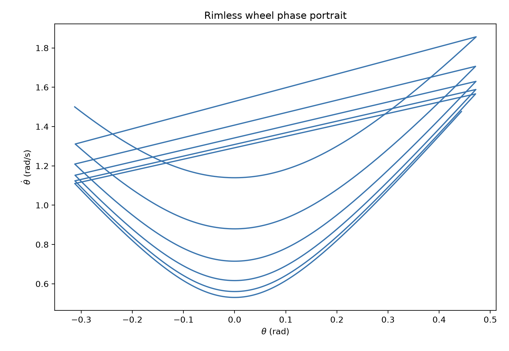</td>
    <td>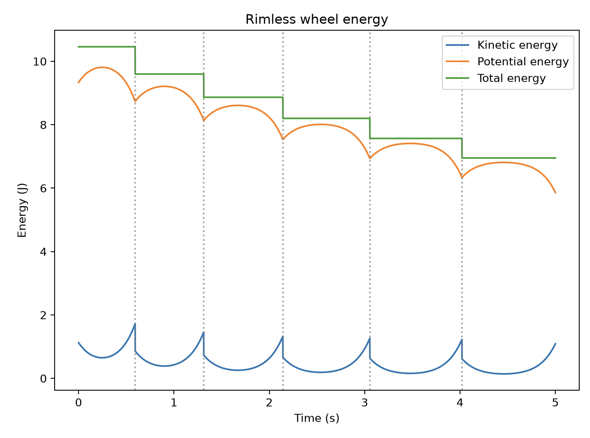</td>
  </tr>
</table>

## Regions of Attraction (RoA)

I then estimated the regions of attraction by brute force.
Using $N = 8$ and $\gamma = 0.08$ rad (which is like, 4.6 deg), I sampled 81 initial angles between $\gamma - \alpha \approx -0.313$ rad and $\gamma + \alpha \approx 0.473$ rad, and 161 initial angular velocities between $-3$ and $3$ rad/s. For these parameters, I expected two stable attractors: standing at rest on two spokes and a downhill rolling limit cycle.

Each simulation ran for up to 30 seconds, stopping early once its outcome could be classified.
I classified rolling when the last six downhill post-impact speeds were positive and each consecutive pair differed by less than $10^{-4}$ rad/s, and classified settling when the wheel had too little energy after a downhill impact to reach the upright position again. This energy check identifies eventual standing without simulating all of the small rocking motions before rest.

To make the grid simulation faster, I used RK4 with a timestep of $0.01$ s and refined the collision time using bisection to a tolerance of $10^{-9}$ s. The simulation applies the impact reset at the contact time and then integrates the remaining part of the timestep. This allows larger steps during smooth motion while locating collisions precisely.

The plot shows the initial angle on the horizontal axis and the initial angular velocity on the vertical axis. Red states were classified as standing, while blue states converged to downhill rolling.

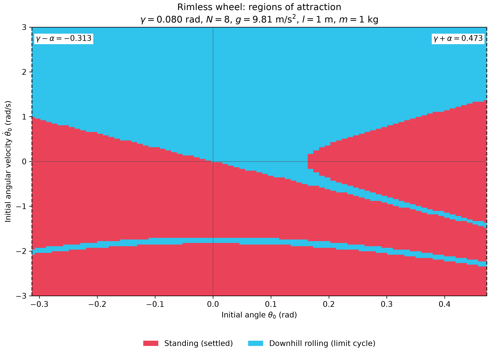

## Poincaré Return Map

I used the collision event as a Poincaré section and constructed a 1D return map using the angular velocity immediately after each impact.

The horizontal axis shows the current post-impact velocity, $\omega_n$, and the vertical axis shows the velocity after the next collision, $\omega_{n+1} = P(\omega_n)$. The black dashed line is the identity line, $\omega_{n+1} = \omega_n$, which is used for stability analysis-- an intersection of the return map with this line indicates an equilibrium point, marked with a cross

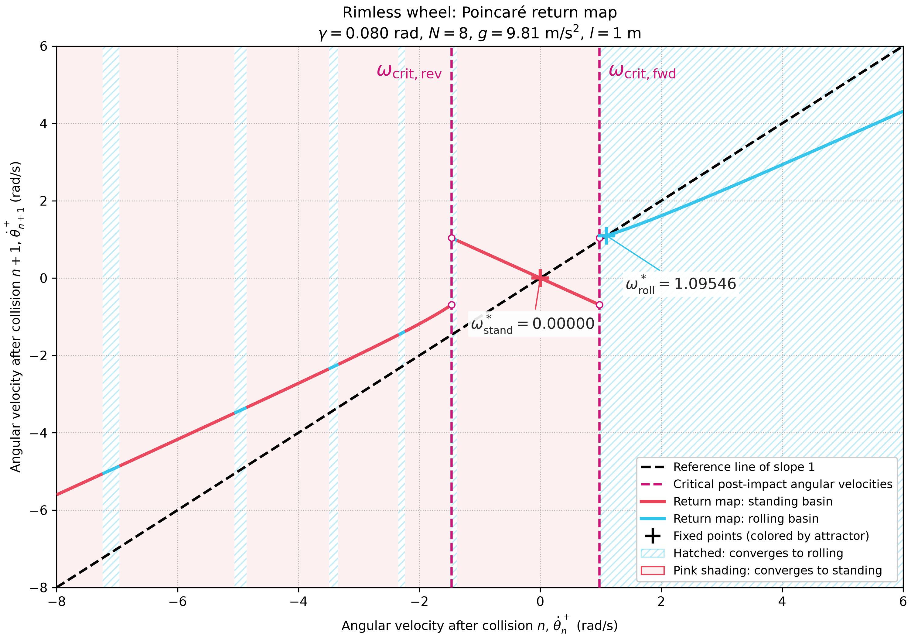

For $N = 8$ and $\gamma = 0.08$ rad, the blue fixed point is at approximately $\omega^* = 1.09546$ rad/s. This equilibrium represents the rolling limit cycle.

The red point at $\omega = 0$ represents the equilibrium where the angle and angular veloctiy are zero, and everything is standing still.

 Pink shading indicates initial post-impact velocities that eventually settle, while blue hatching indicates velocities that converge to rolling. The magenta dashed lines mark the critical velocities, separating uphill steps, rocking returns, and downhill steps.

## Floquet Multiplier

The Floquet multiplier describes how a small disturbance changes from one step to the next near the rolling limit cycle. For this one-dimensional return map, it is the slope at the rolling fixed point, $\lambda = P'(\omega^*)$.

It basically allows us to classify stability: a multiplier with $|\lambda| < 1$ means the errors shrink and the rolling cycle is locally stable, while $|\lambda| > 1$ means they grow. At $|\lambda| = 1$, this linear estimate is inconclusive.

For $\gamma = 0.08$ rad and $N = 8$, I estimated the multiplier by starting slightly above and below the rolling fixed point, $\omega^* \approx 1.09546$ rad/s, and simulating one downhill step from each starting speed. I calculated the slope using

$$
\lambda \approx \frac{P(\omega^* + \varepsilon) - P(\omega^* - \varepsilon)}{2\varepsilon},
$$

where $\varepsilon$ is the size of the speed disturbance. I repeated this for five perturbation sizes, halving $\varepsilon$ each time.

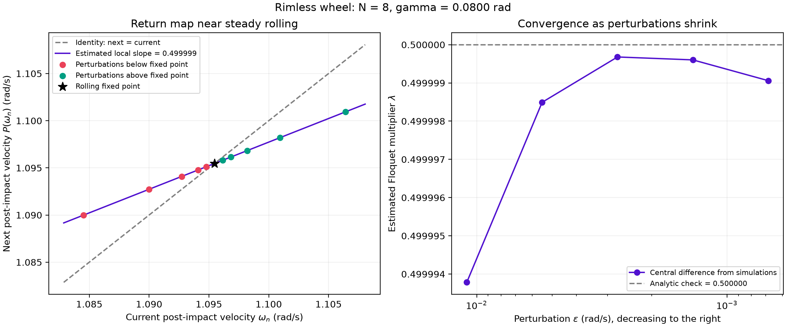

The left plot shows the return map linearized about the rolling fixed point, marked by the black star. Starting slightly below the fixed-point speed gives a higher speed at the next impact, and starting slightly above it gives a lower speed.
 The local slope is approximately 0.5, so this makes the rolling cycle locally stable.

The right plot checks whether the slope estimate changes when smaller perturbations are used. Each point comes from two simulations starting just above and below the fixed-point speed. The estimates remain close to $\lambda = 0.5$, supporting the reliability of the local stability calculation.

## Effects of incline angles $\gamma$

Obviously, $\gamma = 0.08$ rad (4.5 deg) is a very small amount incline, so the question now is, what happens when the angle is increased?

### Incline Angle $\gamma = 0.26$ rad ($N = 8$)

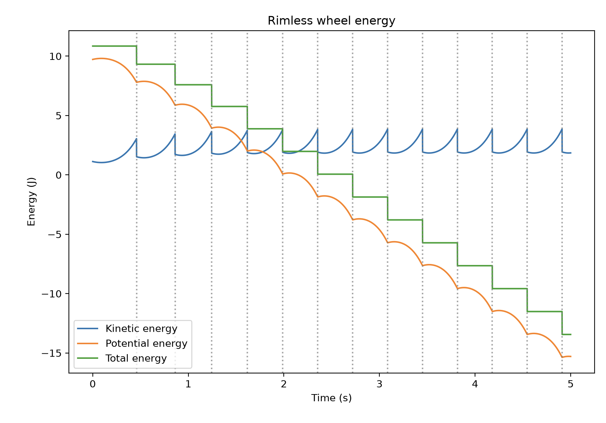

When I increased the incline to $\gamma = 0.26$ rad, as expected, the kinetic-energy increased. The steeper slope produces a larger vertical drop per step, so more gravitational potential energy is converted into kinetic energy.

#### Regions of attraction

I reran the RoA simulation at $\gamma = 0.26$ rad, keeping $N = 8$. Compared with the $\gamma = 0.08$ case, the blue rolling region covers much more of the sampled state space, including many more states with an initially uphill velocity. Again, this makes sense, since the wheel will roll more at a larger incline, therefore, more initial conditions can therefore reach and maintain rolling.

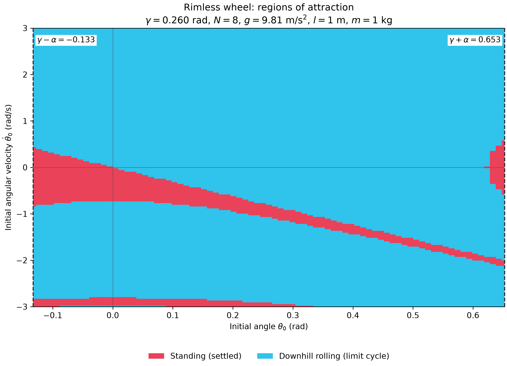

#### Poincaré return map

For the return map, with $\gamma = 0.26$ rad and $N = 8$, the rolling fixed point (where the blue curve crosses the black identity line) increased. This means the wheel reaches a higher steady post-impact speed on the steeper slope, consistent with the increase in kinetic energy shown earlier. The blue hatched regions also cover a wider range of post-impact velocities, agreeing with the larger rolling region in the RoA plot.

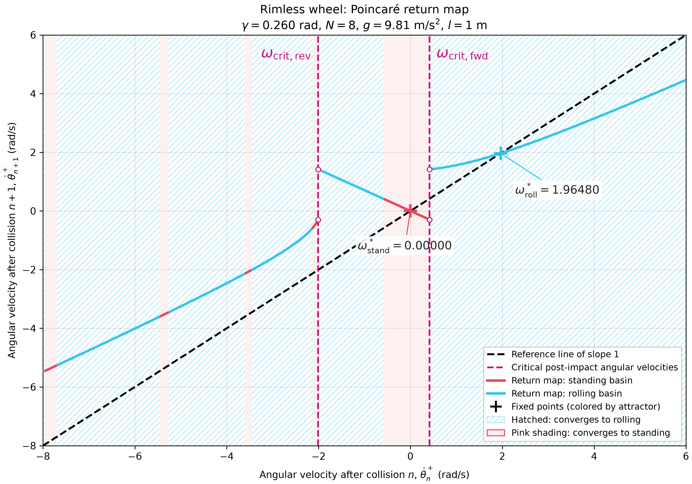

#### Floquet multiplier

I repeated the Floquet calculation for $\gamma = 0.26$ rad by perturbing the post-impact velocity on both sides of the new rolling fixed point, $\omega^* \approx 1.96480$ rad/s.

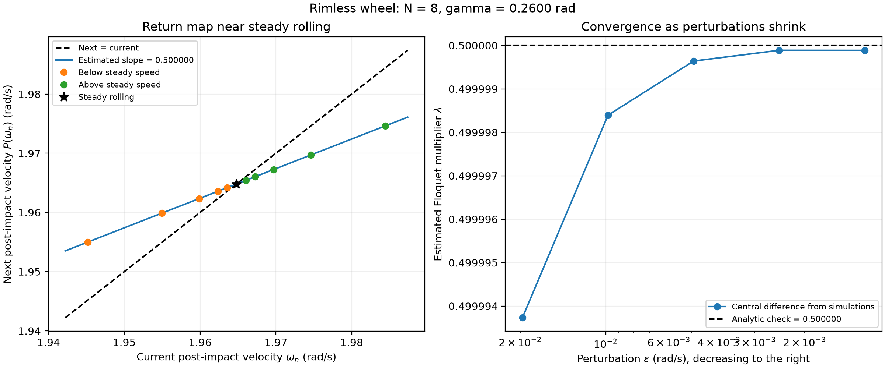

This is essentially a similar multiplier as in the $\gamma = 0.08$ case. For this model, $\lambda = \cos^2(2\pi/N)$ at the rolling fixed point, so keeping $N = 8$ gives $\lambda = 0.5$ for both inclines. The steeper slope increases the steady rolling speed and expands its region of attraction, while small errors near the rolling cycle still decrease by the same factor per step.

### Incline Angle $\gamma = 0.39$ rad ($N = 8$)

I then reran all experiments with $\gamma = 0.39$ rad, keeping $N = 8$.

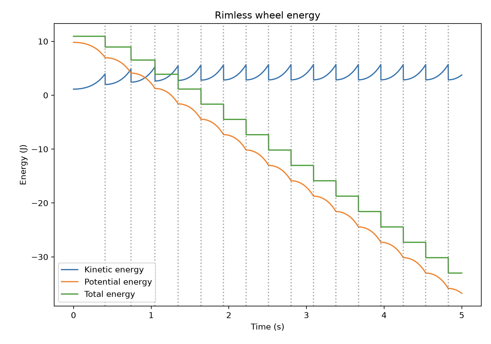

Again, compared with $\gamma = 0.08$ and $\gamma = 0.26$, the kinetic energy is higher because the steeper slope gives a larger vertical drop per step, converting more gravitational potential energy into motion.

The green total-energy curve stays flat between impacts and drops at each collision, consistent with the earlier sanity checks. The drops become larger than in the shallower-slope cases because the wheel has more kinetic energy to lose at impact. The orange potential-energy curve decreases overall as the wheel moves downhill. Potential and total energy eventually become negative because the pointless mass/hub moves below the height chosen as the zero reference.

#### Regions of attraction

At $\gamma = 0.39$ rad, the blue rolling region covers almost the entire sampled state space. This again makes sense in the context of KE dominating the system. Only two grid points were classified as standing, at zero angular velocity at the two contact-angle boundaries.

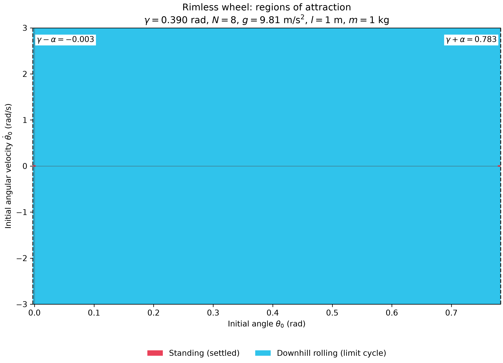

#### Poincaré return map

For $\gamma = 0.39$ rad and $N = 8$, the rolling fixed point has moved to approximately $\omega^* = 2.38937$ rad/s. This is the steady post-impact speed, which is higher than in both previous cases and also agrees with the increase in kinetic energy.

The forward critical velocity is now only about 0.00845 rad/s, placing its magenta dashed line almost at zero. This means very little forward speed is needed to take the next downhill step.

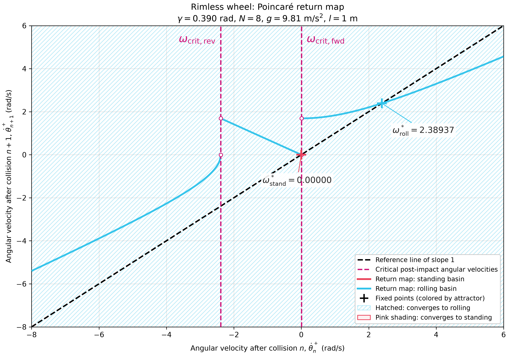

#### Floquet multiplier

The Floquet multiplier at $\gamma = 0.39$ is again approximately $\lambda = 0.5$, the same as for $\gamma = 0.08$ and $\gamma = 0.26$. For this model, $\lambda = \cos^2(2\pi/N)$ depends on the number of spokes, which is still $N = 8$. I the next section, we will see what effects increasing / decreasing the spoke number does to stability.

## Effects of more spokes $N$

### $\gamma = 0.08$ rad, $N = 6$

When I tested the rimless wheel with $N = 6$ spokes on the $\gamma = 0.08$ rad incline, there was not enough energy to keep the wheel moving down the hill -- meaning that more spokes help with that initial velocity push, $\omega_{\mathrm{crit,fwd}}$.

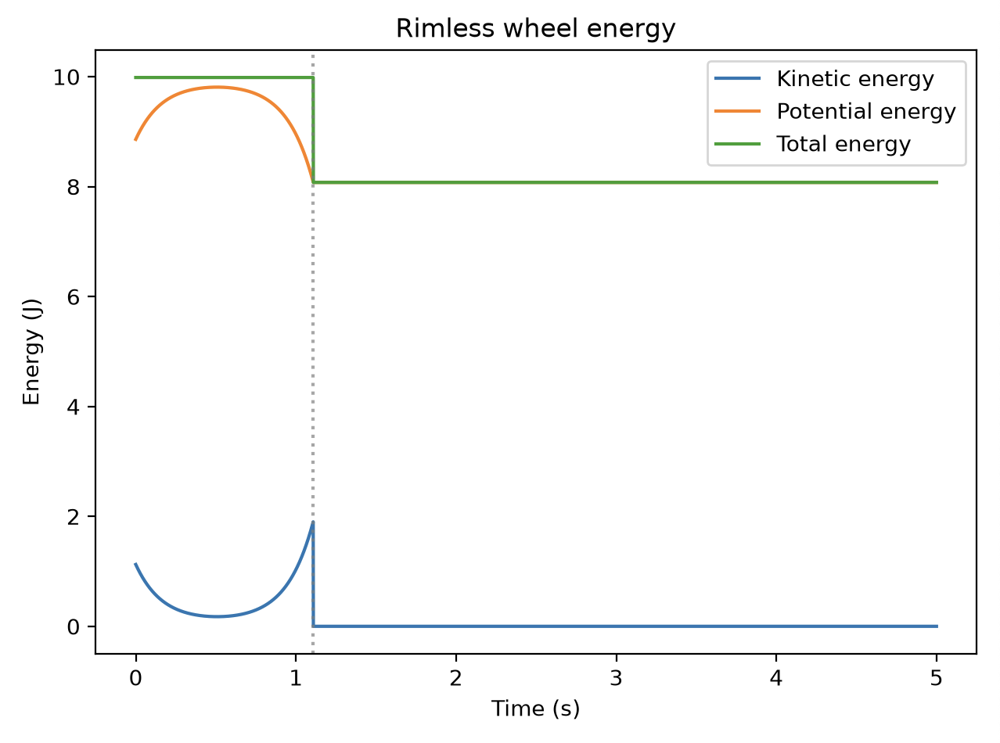

Side note: When the incline angle was really small,
initially my code would enter an infinite loop-- the wheel could lose enough energy to stop rolling and rock back and forth instead. To handle this, I added `should_settle()` in `assignment_1.py`, which after a downhill impact, checks whether the wheel has enough kinetic energy to reach the upright position again. If it does not, the code sets the angular velocity to zero and returns a settled flag, treating the remaining rocking motion as eventual rest.

### $\gamma = 0.39$ rad, $N = 6$

When I increased the incline to $\gamma = 0.39$ rad, the six-spoke wheel was able to maintain rolling, similar to when $N = 8$ at a good incline.

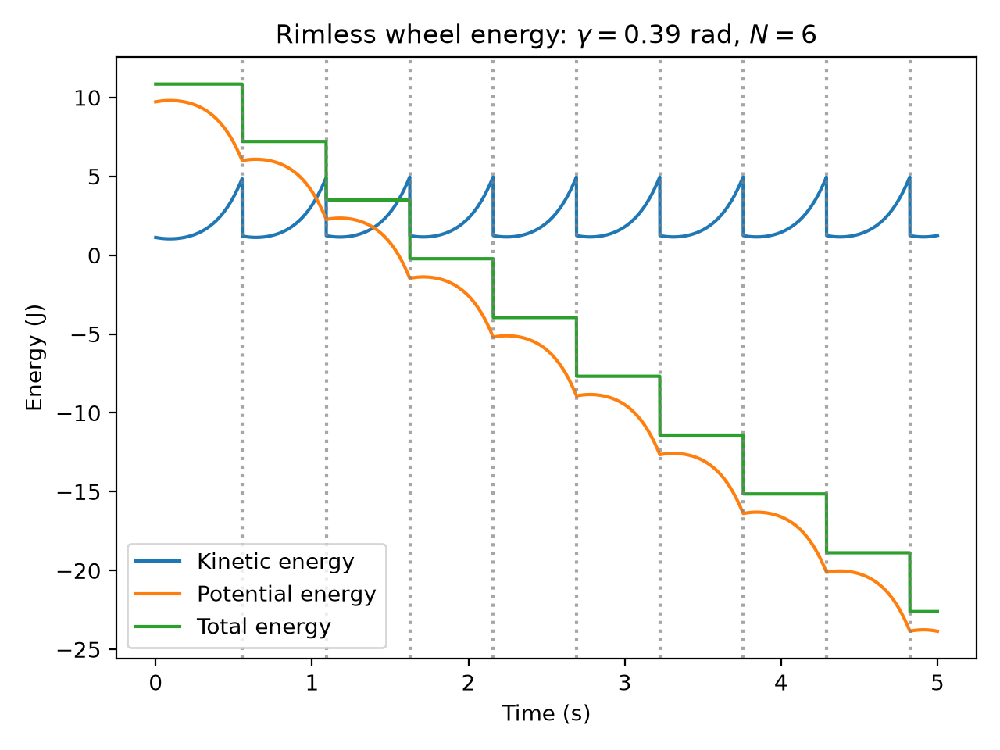

Compared with the eight-spoke wheel at the same incline, the six-spoke wheel loses a larger fraction of its kinetic energy at each impact-- losing 75% instead of 50%. This comes from the larger angle between successive spokes and explains its lower steady kinetic energy. The steeper slope supplies enough energy to sustain this motion, whereas the six-spoke wheel came to rest at $\gamma = 0.08$ rad.

This larger drop in energy can be observed in the other plots as well.

#### Regions of attraction

With six spokes, compared to  $N = 8$, a clear red standing region appears. With eight spokes at the same incline, almost the entire sampled grid reached rolling. The larger collision losses mean that more starting states lose enough energy to settle before reaching the rolling cycle.

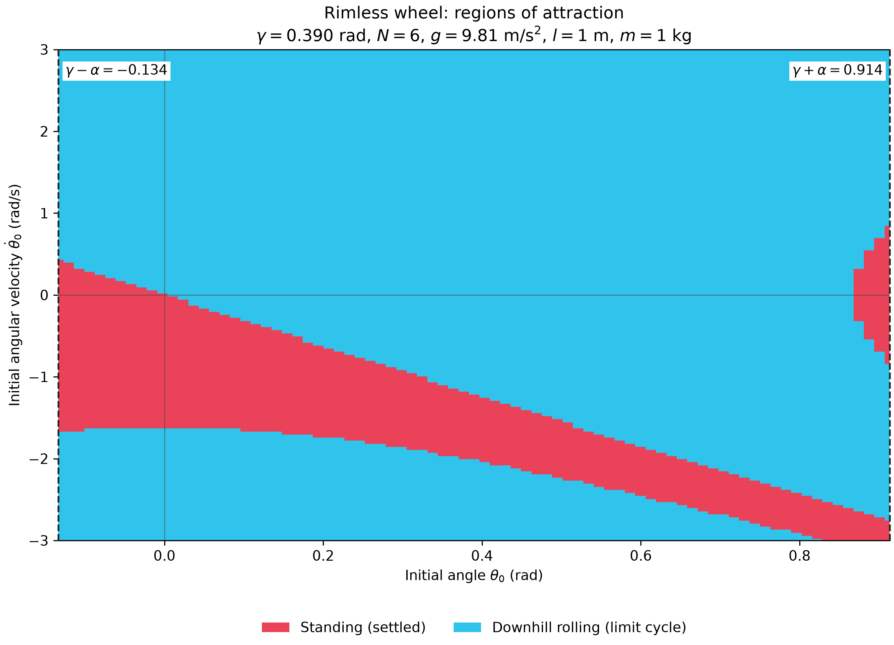

The angle range is also wider because $\alpha = \pi/N$ increases when there are fewer spokes.

#### Poincaré return map

For $\gamma = 0.39$ rad and $N = 6$, the rolling fixed point is approximately $\omega^* = 1.57684$ rad/s, compared with 2.38937 rad/s for eight spokes at the same incline. The larger fraction of energy lost at each collision results in a lower steady post-impact speed.

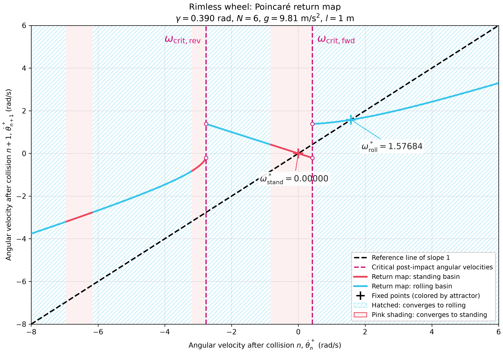

The forward critical velocity has also increased from about 0.00845 rad/s with eight spokes to 0.41813 rad/s with six spokes. With the larger spacing between spokes, the wheel starts each downhill step farther behind upright and needs more speed to pass over it. The wider pink regions show that a larger range of starting velocities eventually settles, consistent with the RoA comparison.

#### Floquet multiplier

Changing the number of spokes also changes the Floquet multiplier. For $N = 6$, the analytic value is $\lambda = \cos^2(2\pi/6) = 0.25$, and the simulation estimate of approximately 0.24999930 agrees closely. Since $|\lambda| < 1$, the rolling cycle is locally stable. A small speed error now shrinks to about one quarter of its previous value after each impact, compared with one half for $N = 8$.
This means that more spokes give a slower local convergence per impact.

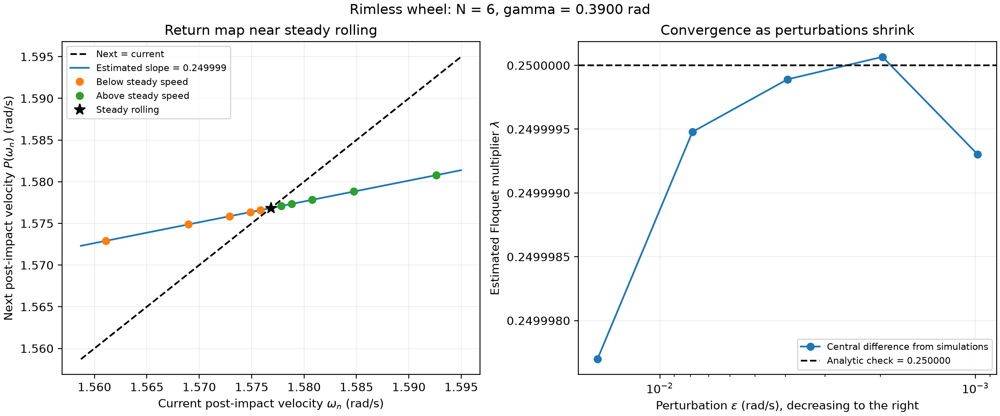

The left plot shows the flatter return map near the rolling fixed point. The right plot checks the slope calculation using smaller and smaller perturbations, with all estimates close to the dashed analytic value of 0.25. This shows that six spokes give faster local convergence per impact, even though the larger collision losses make rolling harder to reach from some initial conditions.

### $\gamma = 0.08$ rad, $N = 12$

With twelve spokes, the wheel can maintain rolling even on the shallow $\gamma = 0.08$ rad incline. Each impact removes only 25% of the kinetic energy, compared with 75% for six spokes and 50% for eight spokes, so the wheel retains enough energy to continue stepping.

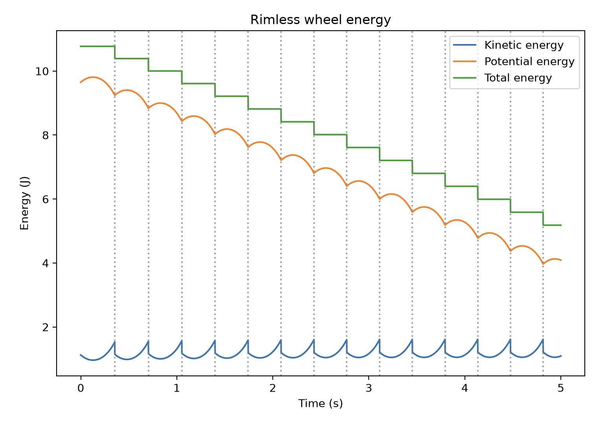

#### Regions of attraction

At the shallower incline of $\gamma = 0.08$ rad, the twelve-spoke wheel still has a large rolling region. The smaller spacing between spokes lowers the energy needed to pass upright, and the smaller collision losses help the wheel keep moving.

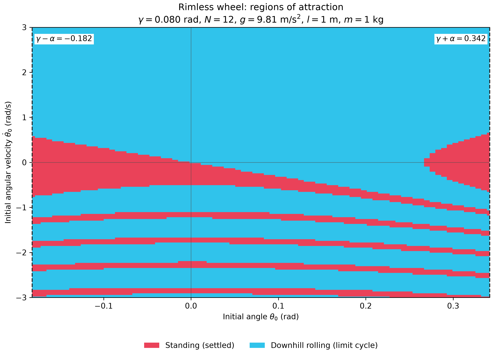

#### Poincaré return map

The rolling fixed point is approximately $\omega^* = 1.56040$ rad/s, which is higher than the eight-spoke value of 1.09546 rad/s at the same incline. Retaining more kinetic energy at each impact allows a higher steady post-impact speed.

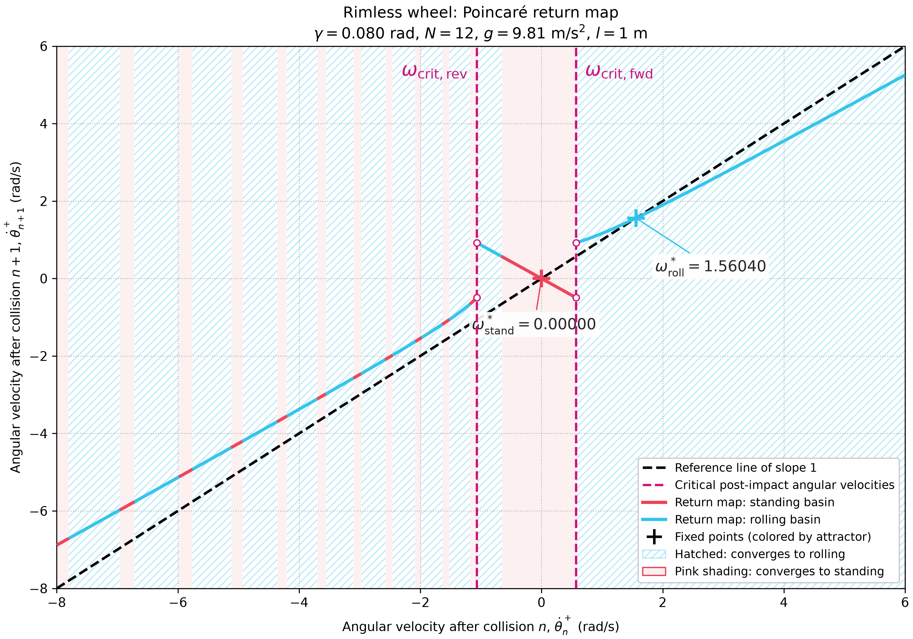

The forward critical velocity decreases to approximately 0.56863 rad/s, compared with 0.97542 rad/s for eight spokes. Less forward speed is therefore needed to pass upright and take the next downhill step.

#### Floquet multiplier

For $N = 12$, the analytic multiplier is $\lambda = \cos^2(2\pi/12) = 0.75$. The numerical estimate, approximately 0.75000025, agrees closely. Since $|\lambda| < 1$, the rolling cycle is locally stable.

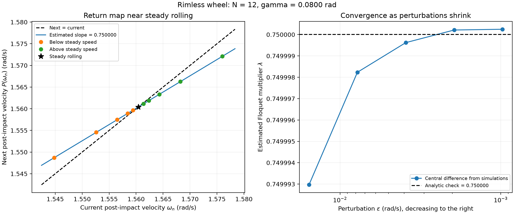

The left plot shows a slope closer to the identity line than in the eight-spoke case. More spokes therefore expand the sampled rolling region at this slope, while small disturbances near the rolling cycle decay more slowly per impact.

### $\gamma = 0.39$ rad, $N = 12$

When I increased the number of spokes to $N = 12$ at $\gamma = 0.39$ rad, we see again an increase in kinetic energy.

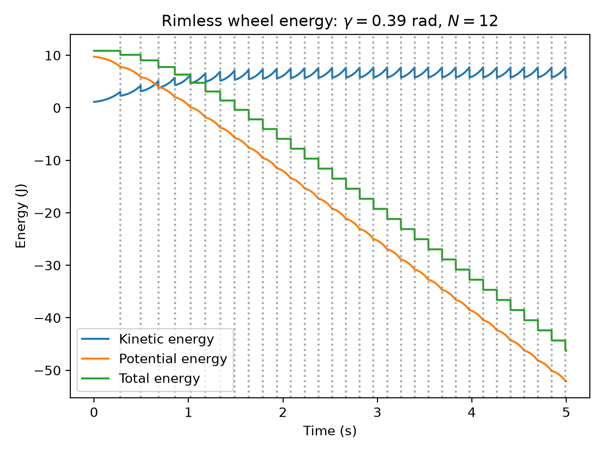

The impacts are more frequent because the spokes are closer together and the wheel rolls faster. As in the previous cases, potential energy decreases as the wheel moves downhill, while total energy stays constant between impacts and drops at each collision.

This $\gamma = 0.39$ case is outside the valid range of the current return-map equations, which assume $0 \leq \gamma \leq \alpha$. The evenly spaced spokes are separated by $2\pi/N$, and $\alpha$ is half of this angle. The maximum incline covered by these equations is therefore

$$
\gamma_{\max} = \alpha = \frac{\pi}{N} = \frac{\pi}{12} \approx 0.2618\text{ rad} = 15^\circ.
$$

Since $0.39$ rad is approximately $22.3^\circ$, it exceeds this limit.

## Summary: incline, spoke count, and convergence

To get a better understanding of the overall relationships between energy, incline, and spoke count, I compared 45 cases with $N = 6$ through $N = 12$, using a $21 \times 41$ grid across each contact interval and initial speeds from $-3$ to $3$ rad/s. The RoA percentages show how many of these sampled states reached rolling; the remainder settled.

### Kinetic energy lost at each impact

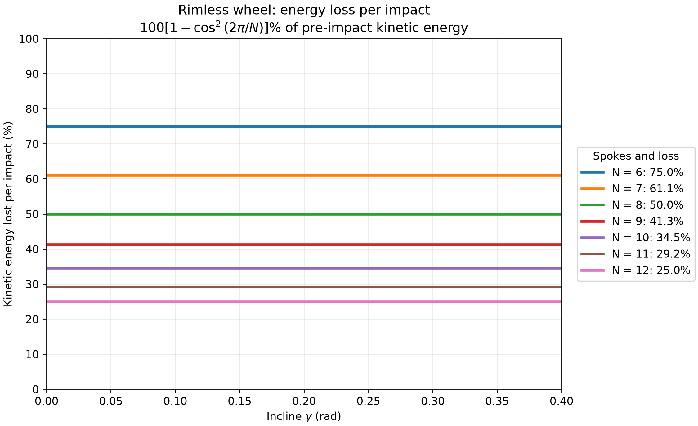
We saw through the other graphs (75% for six spokes, 50% for eight, and 25% for twelve), and it's represented here more clearly: the percentage lost per impact depends on spoke count. The lines are horizontal because this percentage is independent of incline.

### Effect of incline

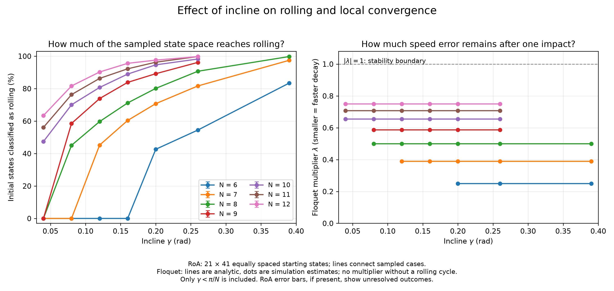

We saw from before that steeper inclines expand the rolling RoA by lowering the energy barrier to supplying more energy per step. The Floquet multiplier stays constant for a given spoke count, so convergence per impact is unchanged. All plotted rolling cycles are locally stable ($|\lambda| < 1$).

### Effect of spoke count

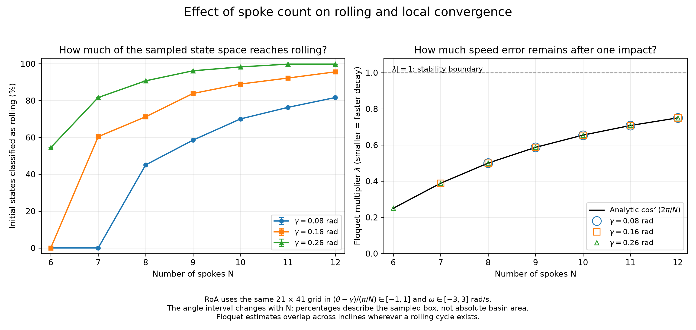

The left plot shows that more spokes generally expand the sampled rolling RoA. Smaller spacing between spokes lowers the energy needed to pass upright and reduces the fraction lost at each collision.

The right plot shows the tradeoff: where rolling exists, $\lambda = \cos^2(2\pi/N)$ increases from 0.25 for six spokes to 0.75 for twelve. A smaller floquet multiplier means there's faster recovery from small speed distrubances after impact.

 So, for maintaining rolling, these results show that more spokes help, and a larger incline helps (which is fairly intuititive).
